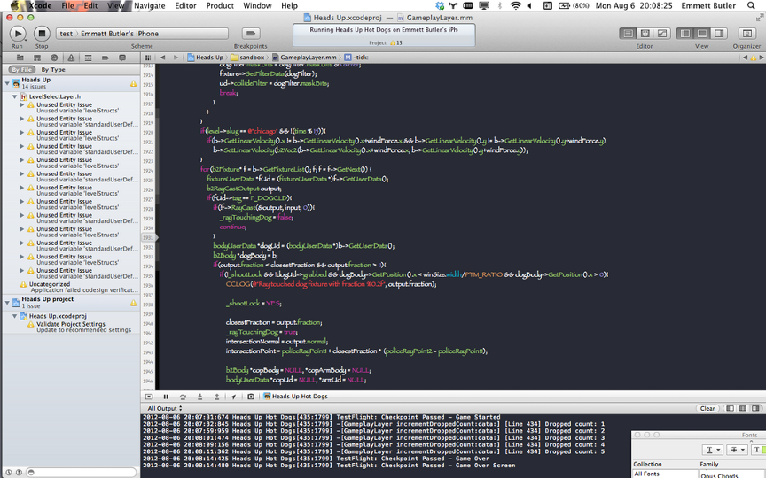
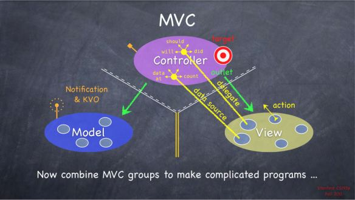
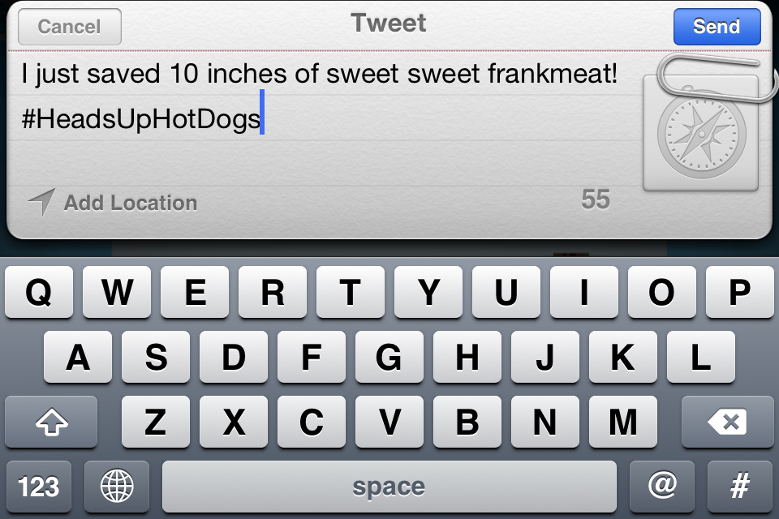

.. include:: <s5defs.txt>

=========================
Basics of iOS Development
=========================

:Author:  Emmett Butler
:Date:    $Date: 2013-01-22 22:52:00 -0500 (Tues, 22 Jan 2013) $

.. This document is copyright Emmett Butler

.. container:: handout

    **How this was made**

    This document was created using Docutils_/reStructuredText_ and S5_.

.. _Docutils: http://docutils.sourceforge.net/
.. _reStructuredText: http://docutils.sourceforge.net/rst.html
.. _S5: http://meyerweb.com/eric/tools/s5/

Read slides on your own
-----------------------

http://github.com/emmett9001/iPhoneGameDemo

http://emmettbutler.com/basic-ios-slides

Meta Information
----------------

**Me**: I'm a Python devotee who learned Objective-C out of necessity. I'm also skilled in Javascript, C/C++ and OpenGL. I love video games and elegant code.

**Professionally**: I've worked part- and full-time at Parsely since 2011, concentrating primarily on web scraping and semantic metadata (see http://schema.to). With my game design partner, I shipped Heads Up Hot Dogs for iOS, published by [adult swim] Games, in October 2012.

**E-mail me**: emmett@parsely.com

**Follow me on Twitter**: emmett9001_

**My game**: headsuphotdogs.com_

.. _emmett9001: http://twitter.com/emmett9001
.. _headsuphotdogs.com: http://headsuphotdogs.com

Why iOS?
--------

.. class:: incremental

    Web apps that try to emulate native functionality will always be imperfect

    No Flash, no HTML5 goodies (video especially)

    A nice-looking, modern mobile app can't be done to the fullest as a web app

    If you want something done right, do it native

Why iOS?
--------

Because this

is what the people want

.. class:: incremental

    Not literally this, of course

iOS Flyover
-----------

.. class:: incremental

    Development environment: Mac exclusive, XCode all the way down

    Language of choice: Objective-C, C, C++

    Frameworks: Foundation, UIKit, OpenGL ES

Using An IDE
------------

.. class:: incremental

    Don't worry.

    The gains in the iOS domain outweigh the losses

XCode Benefits
--------------

If you're writing an iOS app, you're using XCode. It's too convenient not to, and Apple more or less forces it on you

One-stop shop for prepping an iOS app for launch

Python devs will have to make the tradeoff between their favorite Unix-based environment and an IDE-centric one.

XCode *does* automatically update changed files, so editing in vim is an option. ( syntax_ )

Also includes static code analysis, debugging and profiling tools.

.. _syntax: http://www.vim.org/scripts/script.php?script_id=2674

XCode Benefits
--------------

static analysis, iOS integration helpers, console / debugger, GUI breakpoints (actually a big plus), syntax highlighting and awesome autocompletion, an iPhone and iPad simulator

.. class:: incremental

    Also papyrus

The Zen of Objective-C?
-----------------------

.. class:: incremental

    NeXT/Apple's response to object-orientation

    Layer atop C and C++ - superset

    Adds
        * classes, inheritance
        * runtime reflection
        * Smalltalk-style message passing

Objective-C Syntax
------------------

.. sourcecode:: objective-c

    HotDog *myDog = [[HotDog alloc] init]; //*
    [myDog cook];
    myDog.toppings = @[@"teriyaki", @"pineapple", @"green onion", @"bacon"];
    while(![self isFull]){
        [self bite:myDog];
        int bites = [myDog.bitesTaken intValue];
        myDog.bitesTaken = [NSNumber numberWithInt:bites + 1];
    }
    NSLog(@"Tsunami!");

.. Notice here that the last two lines of the loop take the place of C++'s myDog.bitesTaken++. Yup.

Message sends wrapped in [] (or dot syntax)

List/dict displays, string literals with @

*ahem*...verbose

Verbosity
---------

Method arguments are essential parts of the method's name

For example, a typical method prototype in a .h file:

.. sourcecode:: objective-c

    -(Shiba *)init:(NSValue *)s withWorld:(NSValue *)w withFloorHeights:(NSMutableArray *)floorHeights; //*

Which would be called like so:

.. sourcecode:: objective-c

    [myShiba init:[NSValue valueWithPointer:mySpriteSheet]
        withWorld:[NSValue valueWithPointer world]
        withFloorHeights:
            [NSMutableArray arrayWithObjects:
                [NSNumber numberWithInt:floor1],
                [NSNumber numberWithInt:floor2], nil]];

Coming from python (or even javascript) this can be a bit hard to swallow.

Avoiding the Tangle
-------------------

Objective-C gives you more than enough syntactic rope to hang yourself

Avoid intractable method calls by

.. class:: incremental

    * minimizing parameters whenever possible
    * staying away from primitive types, preferring NS* objects
    * using list and dict displays, as well as string literals
    * using convenience constructors whenever possible

.. staying away from primitive types is important because Cocoa often requires wrapping them in NSObjects anyway
.. use convenience constructors whenever an autorelease object will suffice

    All of these I would love to tell my year-ago self at the outset of a major project.

Defining a class (HotDog.h)
---------------------------

Enforced separation of @interface and @implementation

.. sourcecode:: objective-c

    @interface HotDog : NSObject {
        b2World *world;
        CCSpriteBatchNode *spritesheet;
        CGSize winSize;
        b2Body *worldBody;

        CCSprite *sprite1;
        BOOL touched, exploding, grabbed, hasTouchedHead;
        ccColor3B _color_pink;
    }

    -(HotDog *)initWithBody:(NSValue *)b;
    -(NSValue *)getBody; //*

    @end

Interface Definition
--------------------

The @interface specifier denotes a class definition and inheritance

.. sourcecode:: objective-c

    @interface HotDog : NSObject

This is followed by property declarations

.. sourcecode:: objective-c

    b2World *world;
    CCSpriteBatchNode *spritesheet;
    // ...*

and method prototypes (note the '-' signifying it's an instance method)

.. sourcecode:: objective-c

    -(HotDog *)initWithBody:(NSValue *)b; //*

Class Implementation
--------------------

.. sourcecode:: objective-c

    @implementation HotDog

    -(HotDog *)initWithBody:(NSValue *)b{
        self->worldBody = (b2Body *)[b pointerValue];  // bad!
        self->winSize = [CCDirector sharedDirector].winSize;
        return self;
    } //*

    @end

Objective-C Code from a C Programmer
------------------------------------

What's wrong with this code?

.. sourcecode:: objective-c

    self->worldBody = (b2Body *)[b pointerValue];  //*

First off, it should be more like this

.. sourcecode:: objective-c

    self.worldBody = (b2Body *)[b pointerValue];  //*

.. class:: incremental

    What?

    Aren't the dot and the arrow totally different?

    In C, yes - in Objective-C, even more yes.

Dots and Arrows
---------------

.. class:: incremental

    C structs:

        * . : field exists, return value
        * -> : valid pointer, dereference, return value

    Objective-C NSObject subclasses:

        * . : replace with a call to objc_msgSend, look up class definition
        * -> : valid pointer, dereference, return value

    `Arrows do basically the same thing in both languages` `but in Objective-C they bypass message-passing entirely`

What is an Object, Really?
--------------------------

.. class:: incremental

    Objective-C objects are basically C structs with an extra layer of communication on top - specifically, message passing logic.

    As mentioned above, the . operator is replaced by the compiler with a call to objc_msgSend, sending a Smalltalk-like message to the object.

    Objects know what messages they respond to and can throw exceptions on unknown messages.

    Since objects are basically structs, the -> is still usable, but it bypasses this exception system

    object.property is exactly a shorthand for [object property]

Members and @properties
-----------------------

The previous example leaves something out

The data member worldBody is declared as

.. sourcecode:: objective-c

    b2Body *worldBody; //*

Objective-C does not allow . operator access to data members, only functions (that is, objects respond to messages corresponding to their methods)

Effectively, all object attributes are private! (objective, indeed)

Members and @properties
-----------------------

.. class:: incremental

    The . operator sends a message (ie calls a method)

    Our worldBody needs a corresponding set of accessors

    .. image:: img/boring.jpg

    Booooooring

@synthesize-ing Accessors
-------------------------

Luckily, Objective-C can make these for us.

Let's add to our existing class definition

.. sourcecode:: objective-c

    @interface HotDog : NSObject {
        b2Body *worldBody;
    }

    @property (nonatomic, retain) b2Body *worldBody;

    @end //*

Configure accessors (getters and setters) for the member - ie, preparing for the acceptance of setWorldBody messages

The @property Specifier
-----------------------

Python has this too, sort of

There, it's a decorator used for "calculated properties"

More specifically, it allows function calls to look semantically identical to property accesses

.. sourcecode:: python

    class Foo():
        def __init__():
            self.someMember = 42

        @property
        def getSomeMember():
            return self.someMember

The @property Specifier
-----------------------

Though you can use this in python, the exact counterpart to Objective-C's @property is built into Python itself

via __getattr__ and __setattr__

Essentially, Objective-C's @property specifier creates the equivalents of these methods for a given property

@synthesize-ing Accessors
-------------------------

True to the separation of interface and implementation, Objective-C also requires that we actually perform the creation of these accessors in the @implementation block

.. sourcecode:: objective-c

    @implementation HotDog

    @synthesize worldBody;

    // ...

    -(void)init{
        self.worldBody = (b2Body *)[b pointerValue];  //*
    }

    @end

Hooray!

Manual Memory Management
------------------------

.. class:: incremental

    Just like C, no garbage collector for you!

    Instead, Objective-C uses a reference counting system

    Each object knows how many references currently point to itself (if you tell it!)

    When this count reaches 0, the object is deallocated.

    Simple enough, right? Let's see an example:

Reference Counting Example
--------------------------

.. sourcecode:: objective-c

    - (void)setName:(NSString *)newName {
        [newName retain];
        name = newName;
    } //*

"newName" is the id of an object to which we're adding one reference ("name").

Therefore, we send the retain message to tell the runtime that the object referenced by newName now has one new reference

.. class:: incremental

    A wild memory leak appeared!

    .. image:: img/weedle.png

Reference Counting Example
--------------------------

.. sourcecode:: objective-c

    - (void)setName:(NSString *)newName {
        [newName retain];
        [name release];
        name = newName;
    } //*

Not only is the object referenced by newName gaining a reference, but the one referenced by "name" is also losing one!

What if "name" already points to some object that we just orphaned?

.. class:: incremental

    .. image:: img/ash.png

    Gotcha!

Reference Counting Example
--------------------------

This is the crux of manual reference counting. It's not hard if you remember the rules:

    * retain what you own
    * if you own it, release it
    * if you don't own it, don't release it

Autorelease Objects
-------------------

There is also such a thing as an autorelease object, which does not have to be reference-counted

By convention, these are made with convenience constructors

.. sourcecode:: objective-c

    SomeClass *mySomething = [[SomeClass alloc] init];  // manually managed (by convention)*
    [mySomething retain];

    SomeClass *mySomething = [SomeClass initForConvenience];
    // released at the end of the system run loop*

Tempting, but dangerous - for example, it creates temporary leaks when used within tight loops

Automatic Reference Counting
----------------------------

.. class:: incremental

    Recently introduced language feature, activated as a compiler optimization in XCode options

    Generates retain/release code so you don't have to

    This is great...if you're lazy

    Doesn't do anything for "retain cycles" (basically cyclical pointers)

    A garbage collector has the same problem

Object Passing
--------------

.. class:: incremental

    Pass by value? Pass by reference? Something else?

    Actually, similar to python in some ways

    Pointers to objects are actually of type `id`

    Passed by value, sometimes the value is a reference

    Which means...

    Changes to a passed pointer are not visible out of scope (unless you "drop into" pure C/C++ and pass by reference there).

Pass by value
-------------

.. sourcecode:: objective-c

    void func(NSString* string){
        NSLog(@"%@", string);
        // hamburgers
        string = @"something else";
        NSLog(@"%@", string);
        // something else
    }

    NSString *myString = @"hamburgers"; //*
    NSLog(@"%@", myString);
    // hamburgers
    func(myString);
    NSLog(@"%@", myString);
    // hamburgers

Pass by reference
-----------------

Pass by reference can be simulated with two-star programming

.. sourcecode:: objective-c

    - (void)nilThisObject:(MyClass**)foo{
        [*foo release];
        *foo = nil;
    }

    MyClass* bar = [[MyClass alloc] init];
    [self nilThisObject:&bar];
    NSAssert(bar == nil);

Still, the passed star-star is the value of a pointer, not a pointer itself

Runtime Reflection
------------------

In C, all function calls must be resolved at compile or link time (function pointers notwithstanding)

Objective-C allows runtime evaluation of method calls via selectors (effectively string function pointers)

Example:

.. sourcecode:: objective-c

    SEL levelMethod = NSSelectorFromString(level->func);
    CCSequence *seq = [CCCallFunc actionWithTarget:self selector:levelMethod]; //*

Here, levelMethod is essentially the string name of a method.

Later, we hope that self responds to the corresponding message, or we get a runtime UnrecognizedSelector error

Runtime Reflection
------------------

This runtime evaluation of method messages can lead to confusion in a compiled language

Similar to python in that selected attributes are evaluated at runtime

Used mostly for callbacks / asynchronous execution

Careful with colons - the following all very different selectors

.. sourcecode:: objective-c

    @selector(myMethod)
    @selector(myMethod:)
    @selector(myMethod:withParam:andAnother:)

The first takes no parameters, the second takes one, and the third takes three

</crashcourse>
--------------

That's a very brief overview of Objective-C's characteristics as a language.

Let's now discuss some app-building guidelines.

iOS and Cocoa
-------------

**iOS**: Apple's mobile operating system

**Cocoa**: Set of core frameworks for Mac application development (Foundation and AppKit)

**Cocoa Touch**: Set of core frameworks for iOS application development (Foundation and UIKit)

**Foundation**: Provides low-level Objective-C classes, prefixed with NS

**UIKit**: Provides buttons, frames, text boxes, sliders - pre-built UI elements

Cocoa Touch Frameworks
----------------------

.. class:: incremental

    Cocoa Touch is the collective name for the Foundation and UIKit Frameworks

    Foundation provides classes like NSDictionary, NSString, NSNumber, NSMutableArray

    The NS prefix comes from when these classes were part of NeXT's NeXTStep framework

    UIKit provides classes like UIViewController, UIButton, UIView

Model-View-Controller
---------------------

Methodology that separates the behavior and data of an application from the user interface

By their design, the Cocoa / Cocoa Touch frameworks practically force MVC upon you, the developer

You might know the MVC pattern from a web framework like Django (or.... *rails*)

MVC: Comparing Django and Cocoa
-------------------------------

.. class:: incremental

    Models: hold, persist, and manage data

    * **Django**: ORM connects python objects with relational schema
    * **Cocoa**: Typically subclasses of NSObject, built-in ORM is comparatively weak

    Views: user interface elements

    * **Django**: Request data from models, render html templates
    * **Cocoa**: Request data from models, handle drawing of UI elements via "subviews"

    Controllers: manage movement between views

    * **Django**: the framework itself is the controller
    * **Cocoa**: one per each screen of data

.. Django might more accurately be called an MTV_ framework (Model, Template, View). It may be less confusing to think of a Django view as more like a Cocoa ViewController

.. By Cocoa ORM here, I mean the plists that hold NSUserDefaults, which are the closest thing to an *actual* ORM that exists

.. _MTV: https://docs.djangoproject.com/en/dev/faq/general/#django-appears-to-be-a-mvc-framework-but-you-call-the-controller-the-view-and-the-view-the-template-how-come-you-don-t-use-the-standard-names

Cocoa ViewControllers
---------------------

.. class:: incremental

    Each ViewController is by convention responsible for a single screen of data

    Each has a top-level view that can be accessed by other ViewControllers

    ViewControllers create user interfaces by adding subviews to their top-level view

    They follow the "painter's model" - that is, order in which subviews are added to the screen matters

Cocoa ViewControllers
---------------------

This method is called when a controller asks for MyViewController's top-level view, to add a UIImage to the screen

.. sourcecode:: objective-c

    @implementation MyViewController

    - (void)loadView {
        CGRect rect = [UIScreen mainScreen].applicationFrame;
        self.view = [[UIView alloc] initWithFrame:rect];

        UIImageView *imageView = [[UIImageView alloc] initWithFrame:CGRectMake(5,5,200,50)];
        imageView.image = [UIImage imageNamed:@"logo"];
        [self.view addSubview:imageView];
        [imageView release];
    } //*
    // ...
    @end

A Pre-Built ViewController
--------------------------

Using iOS 5's Twitter framework makes this UIViewController subclass available

.. sourcecode:: objective-c

    // a callback for a UIButton
    - (IBAction)tweetButtonPressed:(id)sender{
        TWTweetComposeViewController *tweetSheet = [[TWTweetComposeViewController alloc] init];
        [tweetSheet setInitialText:[tweets objectAtIndex:arc4random() % [tweets count]]];
        [tweetSheet addURL:[NSURL URLWithString:@"http://asw.im/7cz09a"]];

        UIViewController* myController = [[UIViewController alloc] init];
        // add the view to the main view as a subview
        [[[CCDirector sharedDirector] openGLView] addSubview:myController.view];

        // define a callback function for tweet sent
        tweetSheet.completionHandler = ^(TWTweetComposeViewControllerResult result){
            [myController dismissModalViewControllerAnimated:YES];
        };
        // show the view
        [myController presentModalViewController:tweetSheet animated:YES];
    } //*

A Pre-Built ViewController
--------------------------

This code does this

The Application Delegate
------------------------

.. class:: incremental

    There are a number of important events that can happen in the lifetime of an app, some of which are outside of its direct control

    Home button, lock button, phone calls, launching

    AppDelegate is a special object that recieves callbacks from the OS when these events happen

    For example...

The Application Delegate
------------------------

Some examples of callbacks implemented by the app delegate

These allow your app to indirectly communicate with the OS events surrounding it

.. sourcecode:: objective-c

    // home button pressed
    - (void)applicationWillResignActive:(UIApplication *)application;
    // interrupt signal (phone call, home button double-tap)
    - (void)applicationOwnDidEnterBackground:(UIApplication *)application;
    // home button pressed for non-background apps
    - (void)applicationWillTerminate:(UIApplication *)application;
    // app icon touched
    - (void)applicationDidBecomeActive:(UIApplication *)application; //*

A Custom View
-------------

We can define a View by simply subclassing UIView

.. sourcecode:: objective-c

    @implementation OpenGLView

    - (id)initWithFrame:(CGRect)frame{
        self = [super initWithFrame:frame];
        if (self) {
            [self setMeUp];
        }
        return self;
    }

    @end

Returning self here allows us to pass around a reference to this view, which will be used as a subview

Putting it Together
-------------------

An example of using an app delegate to load our custom-built UIViewController

.. sourcecode:: objective-c

    - (BOOL)application:(UIApplication *)application didFinishLaunching{
        self.window = [[UIWindow alloc] initWithFrame:[[UIScreen mainScreen] bounds]];
        self.viewController = [[UIViewController alloc] initWithNibName:@"ViewController_iPhone" bundle:nil];
        self.window.rootViewController = self.viewController;
        [self.window makeKeyAndVisible];

        CGRect screenBounds = [[UIScreen mainScreen] bounds];
        _glView = [[[OpenGLView alloc] initWithFrame:screenBounds] autorelease];
        [self.window addSubview:_glView];

        return YES;
    } //*

Things I Wish I Knew a Year Ago
-------------------------------

.. class:: incremental

    * OO isn't entirely evil once you get to know it
    * Using too much pure C in iOS apps can lead to messy code
    * Quick ways to use built-in data sctructures

OO Isn't So Evil
----------------

OO provides a meaningful set of abstractions into which game objects and concepts fit readily.

**Inheritance**: Entity -> ActiveEntity -> Sprite -> HotDogSprite

**Information Hiding**

.. sourcecode:: objective-c

    @implementation HotDog

    -(NSValue *)getBody{
        return [NSValue valueWithPointer:self->worldBody];
    } //*

    @end

It's also a fine way to address separation of concerns in a UI-focused application (via model, view, and controller objects).

Avoid Weird Mixes
-----------------

If I could do it again, I'd use more Objective-C and less pure C in the Hot Dogs codebase.

Initially attempting to avoid object-orientation, I tried using giant structs and global functions - AKA creating a huge mess.

.. sourcecode:: c

    struct bodyUserData {
        CCSprite *sprite1, *sprite2, *angryFace, *ripples, *overlaySprite, *howToPlaySprite;
        float heightOffset2, widthOffset, lowerXOffset, lowerYOffset;
        CCLabelTTF *countdownLabel, *countdownShadowLabel;
        NSString *_dog_fallSprite, *_dog_riseSprite, *_dog_grabSprite, *_dog_mainSprite, *aimFace;
        CCAction *altAction, *walkRipple, *idleRipple, *altAction2, *altAction3, *altWalk, *altWalkFace, *idleAction, *defaultAction, *angryFaceWalkAction, *dogOnHeadTickleAction, *deathSeq, *shotSeq, *countdownAction, *tintAction;
        CCFiniteTimeAction *postStopAction, *_not_dogContact, *_not_dogOnHead, *_not_leaveScreen, *_not_leaveScreenFlash, *_not_spcContact, *_not_spcOnHead, *_not_spcLeaveScreen, *_vomitAction;
        float rippleXOffset, ogRippleXOffset, rippleYOffset, ogRippleYOffset, deathDelay, moveDelta; // the linear velocity of the person
        double targetAngle;
        int stopTime, stopTimeDelta, timeWalking, restartTime, pointValue, dogsOnHead, spcDogsOnHead, tickleTimer, collideFilter, howToPlaySpriteXOffset, howToPlaySpriteYOffset, ogCollideFilters, _muncher_howToPlaySpriteXOffset, _muncher_howToPlaySpriteYOffset;
        BOOL aiming, touched, exploding, touchLock, aimedAt, grabbed, deathSeqLock, animLock, hasLeftScreen;
        BOOL hasTouchedHead, _dog_isOnHead, _person_hasTouchedDog, _muncher_hasDroppedDog, _cop_hasShot, _busman_willVomit, _busman_isVomiting, hasTouchedGround, _nudie_isStopped, _dog_hasBeenGrabbed;
    }; //*

Avoid Weird Mixes
-----------------

.. class:: incremental

    Using structs instead of objects made true information hiding impossible!

    Members were changed without notice, leading to weird errors in the 8k+ line codebase (not including two huge libraries).

    Additionally, methods were not tied to data in any way, leading to poorly structured code.

    It's fine to use C code for procedural tasks, but don't try to override object-orientation.

    Just use NSObjects, it won't be that bad I promise.

Coding Built-In Data Structures Efficiently
-------------------------------------------

One of the libraries I used for graphics-related tasks allowed callbacks to be defined with selectors, which would fire when animations and other actions finished.

They could only take a single NSObject as an argument:

.. sourcecode:: objective-c

    -(void)removeSprite:(id)sender data:(NSValue *)s {
        CCSprite *sprite = (CCSprite *)[s pointerValue];
        [sprite removeFromParentAndCleanup:YES];
    } //*

Coding Built-In Data Structures Efficiently
-------------------------------------------

Passing multiple parameters into a function like this looked ugly:

.. sourcecode:: objective-c

    -(void)plusPoints:(id)sender data:(void*)params {
        NSNumber *xPos = (NSNumber *)[(NSMutableArray *) params objectAtIndex:0];
        NSNumber *yPos = (NSNumber *)[(NSMutableArray *) params objectAtIndex:1];
        NSNumber *points = (NSNumber *)[(NSMutableArray *) params objectAtIndex:2];
        NSValue *userdata = (NSValue *)[(NSMutableArray *) params objectAtIndex:3];
        bodyUserData *ud = (bodyUserData *)[userdata pointerValue];
        // ...
    } //*

Learning about the list display syntax @[] made this a bit simpler - but still, Objective-C is verbose.

End
----

Your host:

Emmett Butler, http://emmettbutler.com

Heads Up Hot Dogs, http://headsuphotdogs.com

Schema.to, http://schema.to

